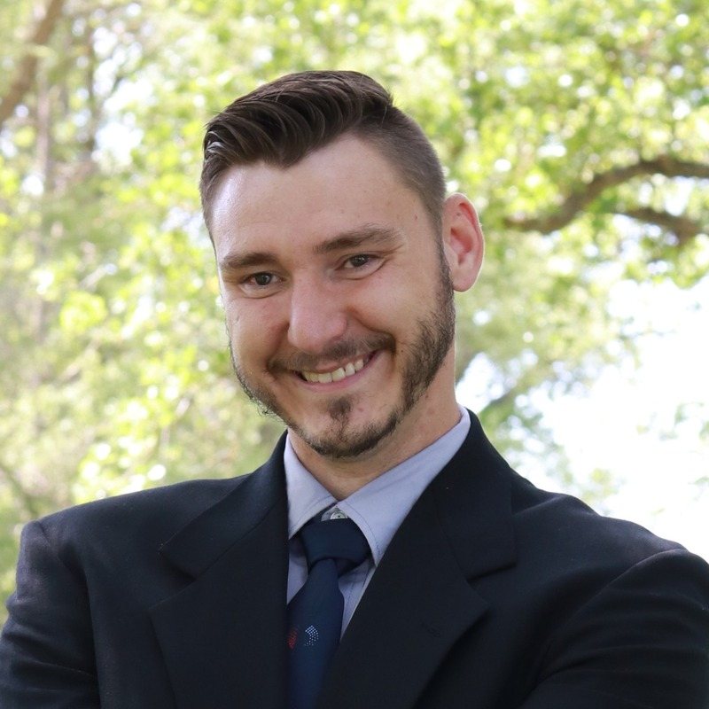

# Sergey Nikitenko
**AI Solutions Integrator & AI-Assisted Systems Developer**
Nikitenkos@hotmail.com · (916) 330-8023 · Kannapolis, North Carolina, USA · github.com/Sergey-Nikitenko

---

## Summary

Systems-focused builder who architects, directs, and ships production software using AI-assisted development. Shipped an end-to-end cybersecurity platform (threat detection + malware detonation sandbox), a low-level data-recovery engine, and a multi-agent memory system exposing a Model Context Protocol (MCP) server — connecting local and cloud LLMs to real systems through Python glue code, APIs, and structured JSON.

## Skills

- **AI-assisted development** — Cursor / Claude Code / Copilot-style pair-programming: architecting systems, generating full codebases, and reviewing/debugging AI output.
- **AI integration** — local (Ollama, LM Studio) and cloud LLM APIs (OpenAI-compatible), tool-calling, Model Context Protocol (MCP), retrieval-augmented memory/recall.
- **Systems** — Linux/KVM/libvirt virtualization, Windows internals (Sysmon, process/network events), filesystem forensics (MFT, raw-sector access), isolated networking (bridges, FakeDNS).
- **Backend / glue code** — Python, JSON-RPC, HTTP, stdlib-first tooling.
- **Security architecture** — EDR/SOAR detection pipelines, sandboxing, layered kill-switches, threat modeling.

## Projects

### Argus — Hybrid AI Cybersecurity Platform (EDR + Detonation Sandbox)
An AI-assisted Windows threat-detection system with an integrated local/cloud LLM pipeline.
- Architected a process-creation detection engine: heuristic scoring → hot-reloadable rule store → Sigma rule generation → semantic memory correlation across incidents.
- Integrated a hybrid AI adjudication layer: local models (Ollama / LM Studio) and cloud APIs route high-risk events for structured MALICIOUS / BENIGN / UNCERTAIN verdicts with tool-calling.
- Built a CAPE/Cuckoo-style malware detonation chamber: a KVM Windows guest with Sysmon telemetry, an isolated FakeDNS sinkhole network, snapshot-revert lifecycle, and layered kill-switches (L1–L5) — all orchestrated programmatically.
- 174 unit tests; deterministic, stdlib-first design.

### Salvage — Low-Level Data Recovery & Forensics Engine
- Built a data-recovery tool using raw sector access, NTFS Master File Table (MFT) parsing, and signature-based file carving to reconstruct deleted and corrupted files.
- Added an HTTP dashboard with background scan state, stall detection, and automatic cancellation for long-running recoveries.

### Akashic Aurora — Agent Memory System (open-source contribution)
- Contributed to an existing open-source multi-agent memory platform (fork of balanced7).
- Co-built the MCP server (learn / recall / note / status tools over JSON-RPC) with the platform's author.
- Built the 8-organ "brain" subsystem — valence, dynamic attention, consolidation, working memory, homeostasis, and more — plus the typed semantic edge graph (similar_to / associated_with) and the Janus Key graph traversal.
- Contributed to the outcome-credited recall feedback; made extensive edits to the DeepSeek Harness boot-inject plugin.

### Coloring Book Web Portal
- Built a headless web catalog hosting coloring books with Amazon affiliate integration and a custom admin panel.

---

## Work Experience

### Siemens Mobility — Data Analyst / Operational Services Specialist
*Feb 2021 – Present*

- Built a Power BI KPI report to track and visualize key operational metrics for leadership.
- Designed a red-tag tracking tool in Microsoft Lists, automated with Power Automate flows to streamline tracking and notifications.
- Automated Excel data-tracking workbooks with VBA, replacing manual data entry and processing.

## Education & Background

Self-directed systems engineer — learned Python, virtualization, and AI integration hands-on by shipping production projects.
